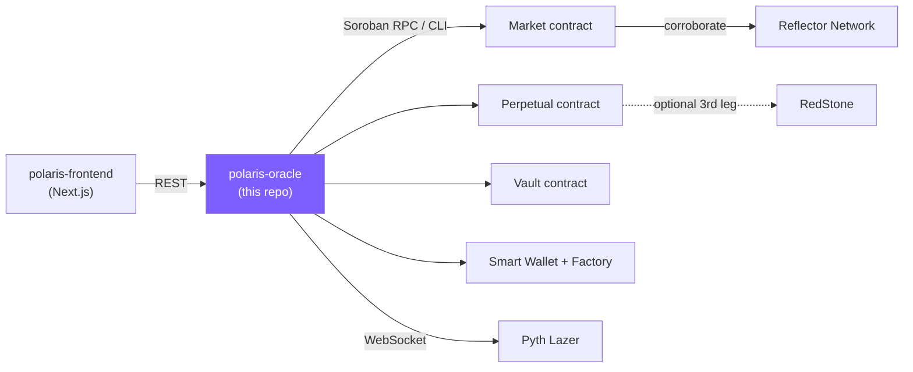

# polaris-oracle

[](https://github.com/only1dreamgene/polaris-oracle/actions/workflows/ci.yml)
[](https://github.com/only1dreamgene/polaris-oracle/actions/workflows/fly-deploy.yml)
[](./LICENSE)

NestJS settlement automation, multi-oracle price relay, and gasless
transaction relay for **Polaris**. This is the backend: it watches deployed
markets, relays Pyth Lazer prices at expiry, calls `settle`/`cancel`,
deploys new markets and perpetuals automatically, sponsors every
passkey/email-wallet trade so users never need to hold XLM for gas, and
exposes a public read API, an admin API, and a testnet faucet.

This is one of three repos that make up Polaris:

| Repo | Role |
|---|---|
| [polaris-contracts](https://github.com/only1dreamgene/polaris-contracts) | The on-chain rules: markets, perpetuals, the LP vault, passkey wallets |
| **polaris-oracle** (this repo) | The backend — this document |
| [polaris-frontend](https://github.com/only1dreamgene/polaris-frontend) | Next.js web app — trading UI, portfolio, embeddable widget, admin dashboard |

## Live

**API**: [`https://polaris-oracle.fly.dev`](https://polaris-oracle.fly.dev) — deployed on Fly.io, auto-deployed on every push to `main`.

```sh
curl https://polaris-oracle.fly.dev/markets
curl https://polaris-oracle.fly.dev/perpetuals
```

The web app consuming this API is at
[polaris-frontend-delta.vercel.app](https://polaris-frontend-delta.vercel.app).

> **Live-deployment caveat, stated plainly**: this instance has no real
> `PYTH_LAZER_TOKEN` configured (none was available to generate one against
> for this build) — the same limitation local dev has always had. Every
> market on the live instance therefore settles via the permissionless
> `cancel()` fallback at grace expiry rather than a genuine Lazer-verified
> `settle()`. The settlement *logic* itself is fully covered by unit tests
> and was verified live against the mock Lazer verifier during development
> — see [Bugs found by pressure-testing this system](#bugs-found-by-pressure-testing-this-system).

## Contents

- [Features](#features)
- [Tech stack](#tech-stack)
- [Architecture](#architecture)
- [Project layout](#project-layout)
- [API reference](#api-reference)
- [Running locally](#running-locally)
- [Testing](#testing)
- [Deployment](#deployment)
- [Design notes](#design-notes)
- [Bugs found by pressure-testing this system](#bugs-found-by-pressure-testing-this-system)
- [Known gaps](#known-gaps)
- [Contributing](#contributing)

## Features

- **Multi-oracle settlement.** Settlement is verified against a signed Pyth
  Lazer payload, cross-checked off-chain against Pyth's own Hermes endpoint
  (defense-in-depth) and, on-chain by the contract itself, against Reflector
  Network and optionally RedStone — see [Design notes](#design-notes).
- **Fully automated market lifecycle.** `MarketFactoryService` deploys new
  markets from a configured feed catalog on a timer, funds their seed
  liquidity from the capital-efficiency vault, and immediately rolls a
  successor the moment a market resolves — no human clicks a button.
- **Perpetual markets.** A second, parallel contract kind (no expiry, no
  settlement) with its own route family, sharing the same sponsored-trade
  and oracle-verification infrastructure as classic markets.
- **Gasless, passkey-secured trading.** Users sign with a WebAuthn passkey
  (Face ID / Touch ID / Windows Hello); this backend pays every transaction
  fee and relays the signed authorization on-chain via a two-step
  prepare/submit protocol.
- **Email login as a custodial alternative.** A JWT-cookie session backs an
  encrypted custodial wallet for users who don't want passkeys.
- **Admin dashboard API.** Read-only, `x-admin-key`-gated endpoints for
  overview stats, fee revenue, treasury flows, wallet activity, and
  settlement cross-check history — built with no separate indexer, since
  every trade already flows through this process at submission time.
- **Testnet faucet**, rate-limited per address.

## Tech stack

| | |
|---|---|
| Framework | [NestJS](https://nestjs.com) 11, Express platform |
| Chain SDK | [`@stellar/stellar-sdk`](https://www.npmjs.com/package/@stellar/stellar-sdk) 16 (`contract.Client`, `contract.Spec`) + the `stellar` CLI for deploys |
| Price feed | [`@pythnetwork/pyth-lazer-sdk`](https://www.npmjs.com/package/@pythnetwork/pyth-lazer-sdk) (WebSocket) |
| Persistence | `better-sqlite3`, WAL journal mode |
| Auth | WebAuthn passkey relay (custom) + JWT session cookies for email login |
| Testing | Jest, 121 unit tests |
| Deployment | Docker on [Fly.io](https://fly.io), GitHub Actions CI/CD |

## Architecture



## Project layout

| File | Responsibility |
|---|---|
| `stellar.service.ts` | All Stellar/Soroban I/O: reads via RPC simulation, oracle-authorized writes (`settle`/`cancel`/wallet deploy) via `contract.Client`, market deployment via the Stellar CLI. |
| `auth-relay.service.ts` | Sponsors passkey-authorized calls: this process pays the fee, a WebAuthn passkey signs the Soroban authorization entry, in two HTTP round-trips (`prepare` / `submit`). |
| `oracle.service.ts` | Pyth Lazer WebSocket client. Exposes `isAvailable` and `waitForUpdate`. |
| `market.service.ts` | Settlement orchestration: arms a timer per watched market, falls back to permissionless `cancel` on any failure or oracle outage, re-arms on process restart. |
| `market-factory.service.ts` | Automated market creation: sweeps a configured feed catalog on an interval *and* reacts immediately when a tracked market resolves. |
| `market-events.ts` | A trivial injectable `EventEmitter` wrapper — decouples `MarketService` from `MarketFactoryService` without a circular Nest DI dependency. |
| `pyth-price.ts` | Shared Hermes-price fetch/conversion, used by both the factory and the settlement cross-check. |
| `market.repository.ts` | WAL-journaled SQLite persistence via `better-sqlite3`. |
| `perpetual.service.ts` / `.controller.ts` / `.repository.ts` | The perpetual contract's counterpart to the three files above — no expiry, no settle, so none of `MarketService`'s timer logic applies. |
| `admin.guard.ts` | `x-admin-key` check, constant-time compare, fails closed if unset. |
| `admin.controller.ts` / `admin-activity.repository.ts` | The admin dashboard's read API and its backing activity log. |
| `faucet.service.ts` | Rate-limited (3/hour/address) Friendbot funding. |
| `wallet-deploy-rate-limiter.service.ts` | Same shape as `FaucetService`, keyed by IP — mitigates `POST /wallets/deploy`'s unauthenticated-by-design abuse surface. |
| `contracts.ts` | Loads `wasm/*.wasm` and parses each contract's real spec via `contract.Spec.fromWasm`. |
| `wire-args.ts` | Converts JSON-transportable request args into `xdr.ScVal[]`, injecting the wallet's own address into whichever parameter authorizes each sponsored call. |

## API reference

All endpoints are relative to `https://polaris-oracle.fly.dev` (or
`http://localhost:3001` locally). Admin endpoints require an `x-admin-key`
header.

### Markets

| Method | Path | Auth | Description |
|---|---|---|---|
| `GET` | `/markets` | — | List all tracked markets |
| `GET` | `/markets?feedId=` | — | List markets for one feed (find a resolved market's successor) |
| `GET` | `/markets/:id` | — | Tracked market metadata |
| `GET` | `/markets/:id/state` | — | Live on-chain state |
| `GET` | `/markets/:id/position?address=` | — | A wallet's YES/NO share balances |
| `GET` | `/markets/:id/price` | — | Current AMM-implied price, plus `yesBpsChange` (real recorded history, `null` if none exists yet — see [Design notes](#design-notes)) |
| `GET` | `/markets/:id/fee` | — | Current effective fee (bps) |
| `POST` | `/markets/faucet` | — | Fund a testnet address (rate-limited) |
| `POST` | `/markets/create` | admin | Deploy + initialize a new market |
| `POST` | `/markets/watch` | admin | Track an already-deployed market |
| `POST` | `/markets/factory/run` | admin | Trigger a factory sweep on demand |
| `POST` | `/markets/:id/settle` | admin | Settle against a live Lazer price |
| `POST` | `/markets/:id/cancel` | admin | Cancel (liveness backstop) |

### Perpetuals

| Method | Path | Auth | Description |
|---|---|---|---|
| `GET` | `/perpetuals` | — | List all tracked perpetuals |
| `GET` | `/perpetuals/:id` | — | Tracked perpetual metadata |
| `GET` | `/perpetuals/:id/state` | — | Live on-chain state |
| `GET` | `/perpetuals/:id/position?address=` | — | A wallet's YES/NO share balances |
| `GET` | `/perpetuals/:id/price` | — | Current AMM-implied price |
| `GET` | `/perpetuals/:id/fee` | — | Current effective fee (bps) |
| `POST` | `/perpetuals/create` | admin | Deploy + initialize a new perpetual |
| `POST` | `/perpetuals/:id/checkpoint` | admin | Record an informational price checkpoint |
| `POST` | `/perpetuals/:id/terminate` | admin | Wind down (0.5/pair payout) |

### Wallets & sponsored trading (passkey)

| Method | Path | Auth | Description |
|---|---|---|---|
| `GET` | `/wallets/resolve?publicKeyHex=` | — | The address a passkey would deploy to |
| `POST` | `/wallets/deploy` | — | Gasless smart-wallet deploy |
| `POST` | `/wallets/tx/prepare` | — | Step 1 of the sponsored-relay: build the auth entry to sign |
| `POST` | `/wallets/tx/submit` | — | Step 2: submit the passkey-signed entry, sponsored |

### Email login (custodial)

| Method | Path | Auth | Description |
|---|---|---|---|
| `POST` | `/auth/email/request` | — | Request a login code |
| `POST` | `/auth/email/verify` | — | Verify the code, start a session |
| `GET` | `/auth/email/me` | session cookie | Current session's identity |
| `POST` | `/auth/email/trade` | session cookie | Sign + submit a trade with the custodial wallet |
| `POST` | `/auth/email/logout` | session cookie | End the session |

### Prices & admin

| Method | Path | Auth | Description |
|---|---|---|---|
| `GET` | `/prices/:feedId` | — | Current Hermes price for a feed |
| `GET` | `/admin/overview` | admin | Market/perpetual counts by status |
| `GET` | `/admin/fee-revenue` | admin | Fee revenue, per-market breakdown |
| `GET` | `/admin/treasury` | admin | Treasury inflows/outflows |
| `GET` | `/admin/wallets` | admin | Wallet activity log |
| `GET` | `/admin/network` | admin | Contract addresses, wasm hashes |
| `GET` | `/admin/settlement-checks` | admin | Oracle-corroboration history |

## Running locally

```sh
cp .env.example .env   # fill in ORACLE_SECRET_KEY, ADMIN_API_KEY at minimum
npm install
npm run start:dev      # http://localhost:3001
npm test                # 130 unit tests
```

`ORACLE_SECRET_KEY` is the only hard requirement to boot — everything else
degrades gracefully (no `PYTH_LAZER_TOKEN` → markets fall back to
permissionless `cancel` at grace expiry instead of settling; no admin key
→ every admin route rejects, per `AdminGuard`'s fail-closed design).

## Testing

```sh
npm test          # jest — 121 unit tests across 24 suites
npm run lint
```

Every bug in [Bugs found by pressure-testing this system](#bugs-found-by-pressure-testing-this-system)
shipped with a regression test that was confirmed to fail against the old
code and pass against the fix — not just written to pass once.

## Deployment

Deployed on [Fly.io](https://fly.io) as a single always-on machine
(`fly.toml`) — `auto_stop_machines` is deliberately `off` and
`min_machines_running = 1`, since idle-suspend would kill the live Pyth
Lazer WebSocket and the in-process settlement timers. A persistent volume
(`polaris_oracle_data`) backs the SQLite database. `.github/workflows/fly-deploy.yml`
redeploys automatically on every push to `main`, using a scoped deploy
token stored as a repository secret.

```sh
flyctl deploy -a polaris-oracle
```

## Design notes

### Why native XLM, no custom test token

The market contract's collateral is generic (any Stellar Asset Contract).
This build uses the **native XLM SAC** rather than minting a custom test
token: Friendbot already funds new testnet accounts with XLM for free, so
there's no faucet-mint logic or token-admin key to manage.

### Passkey smart wallets

`wallet.controller.ts` exposes the resolve/deploy/prepare/submit endpoints
listed in [API reference](#api-reference) above. See `auth-relay.service.ts`'s
doc comment for the full two-round-trip protocol and why it's necessarily
two round-trips (a passkey signature means an actual Face ID/Touch ID
prompt in the browser, not a synchronous in-process callback).

Note: the embeddable market widget (`<iframe>`-able on any third-party
site) lives in `polaris-frontend`'s `/embed/[id]`, **not** here — WebAuthn's
relying-party id is tied to the document's origin, so the widget has to be
served from the same origin as the flagship app for a passkey to be usable
in both places.

**Status: verified live, end to end**, not just structurally complete —
`polaris-frontend`'s README documents a Playwright-driven run against a
real headless Chromium instance with Chrome DevTools Protocol's `WebAuthn`
domain providing a virtual authenticator: a real wallet deployed through
this backend, a real `tx/prepare` → WebAuthn assertion → `tx/submit` round
trip, confirmed on testnet with `getTransaction` status `SUCCESS`, and the
AMM pool/position moving by exactly the amounts predicted beforehand. What
remains unexercised is narrower than "unverified": only the literal
hardware prompt (an actual Face ID/Touch ID sensor) hasn't fired — an
OS/browser-level interaction outside any codebase's own logic. There is
still no automated CI test covering the live RPC round-trip itself (see
[Known gaps](#known-gaps)) — the verification above was a real manual run,
not a repeatable regression test.

### Market factory automation

`MarketFactoryService` closes the last manual step in market creation:
until now, `POST /markets/create` needed a human to pick a strike price,
fund `initial_liquidity` from their own balance, and click a button. The
factory sweeps a configured feed catalog (`FEED_CATALOG` — see
`.env.example`) on an interval (`MARKET_FACTORY_INTERVAL_SECS`, default
6h) and, for each feed with no open/pending tracked market: reads the
current price from Pyth's Hermes HTTP API, withdraws seed liquidity from
the capital-efficiency vault, deploys the market with `treasury` set to
the vault's own address, and registers it with `MarketService.watch()`.

**Verified live on testnet**: deposited 500 XLM into the deployed vault,
triggered `POST /markets/factory/run`, and confirmed it withdrew 100 XLM,
deployed and initialized a real market with `treasury` = the vault and
`strike_price` matching the live Hermes price at the time, and the vault's
on-chain balance dropped by exactly the withdrawal amount.

### Auto-rolling successor markets

"Perpetual" here (for classic markets) means **auto-rolling**, not a new
contract: no funding-rate mechanic, no persistent cross-round position —
each round is still a fully independent, fully-collateralized market.
What's automated is *creating the next one*, so a feed never sits dark.

`MarketService.persist()` emits a `'finalized'` event the moment a tracked
market *newly* transitions into `settled` or `cancelled`.
`MarketFactoryService` listens and immediately rolls that feed if it's in
the catalog, instead of waiting for the periodic sweep (now every 5
minutes, down from the factory's original 6-hour cadence, as a safety net
rather than the primary trigger). `onModuleInit` also runs one immediate
reconciliation pass on boot for the gap neither the event nor the timer's
first tick covers.

`GET /markets?feedId=` lets a caller find a resolved market's successor
once one exists, to link "next round" rather than dead-ending.

**Verified live on testnet**: cancelled a short-grace test market and
confirmed the successor was created within ~1 second via the event path,
with correct on-chain wiring. Also verified the failure path: a
vault-withdrawal failure during a live event-triggered roll was caught,
logged with the real on-chain reason, and correctly produced no
underfunded market.

### Historical odds & the ticker "Chg" column

`polaris-frontend`'s markets list shows each market as a ticker row —
symbol, current YES/NO odds, and a real "Chg" figure. That last one needed
actual history to exist, not just a UI mockup: `OddsSnapshotService`
records every open classic market's odds on an interval
(`ODDS_SNAPSHOT_INTERVAL_SECS`, default 5 minutes — same cadence as
`MarketFactoryService`'s safety-net sweep) into a new `odds_snapshots`
table (`OddsSnapshotRepository`, same SQLite file as everything else).

`GET /markets/:id/price` reads the closest snapshot at or before
`now - ODDS_CHANGE_WINDOW_SECS` (default 1 hour) and returns
`yesBpsChange = currentYesBps - thatSnapshot.yesBps` alongside the current
odds. **`null`, not `0`, when no snapshot exists that far back yet** — a
market younger than the window, or a fresh deployment where the snapshot
service hasn't run long enough — since `0` would claim "no movement,"
a different and false claim from "nothing to compare against yet." The
frontend renders that as a plain dash rather than a fabricated "+0%".

Scoped to classic markets only for now, matching the ticker redesign it
backs — perpetuals don't get a "Chg" column in this round (see
[Known gaps](#known-gaps)). Its own timer, deliberately not folded into
`MarketFactoryService`'s existing one: a factory failure and a snapshot
failure are unrelated concerns, and coupling them would mean a factory
bug could also silently stop odds history from being recorded. Bounded
growth: snapshots older than 7 days are pruned on every run — comfortably
longer than any market's real lifetime (expiry + grace period), so
nothing a caller could still plausibly want is ever deleted.

### Perpetual markets

`polaris-perpetual` (see `polaris-contracts`'s README) is a second,
parallel contract kind — continuous trading, no strike price, no expiry,
no `settle`. Wired as its own route family (`/perpetuals`) rather than
folded into `/markets` — a shared schema would mean a pile of columns
meaningless for one contract kind or the other.

**Trading reuses the existing sponsored-relay path unchanged.**
`buy`/`sell`/`split`/`merge`/`redeem`/`transfer` have identical names and
argument shapes on both contracts, so the relay/signing services gained
one new optional parameter — `contractKind: 'market' | 'perpetual'`
(default `'market'`) — that picks which compiled `contract.Spec` to encode
arguments against. No new signing/relay logic at all.

`price_oracle` is a real Lazer + Reflector + RedStone bundle when all
three are configured, `None` otherwise — `polaris-contracts`'s
`mock-redstone` closes the gap that RedStone has no testnet deployment.

**Live-verified end-to-end through the real API**: `POST /perpetuals/create`
deployed and initialized a real testnet contract with a genuine
`price_oracle` bundle attached; a `buy` then a `sell` through
`POST /auth/email/trade` round-tripped correctly; `POST /perpetuals/:id/terminate`
wound it down; a final `redeem` paid out and drained the position to zero.
The dashboard's aggregate counts and fee-revenue totals picked up all of
it correctly — which is also what caught bug 11 below. The checkpoint
path's oracle logic (unanimous corroboration, not just "wired up") was
verified directly against the real contracts on testnet, bypassing the
token-gated `OracleService`: a hand-built Lazer payload agreeing with both
Reflector and the mock RedStone succeeded and recorded the checkpoint; a
second attempt with the mock deliberately diverging correctly rejected
with `OracleDivergence`.

### Off-chain multi-oracle settlement cross-check (Pyth-internal)

"Redundant multi-oracle" here means a **Pyth-internal cross-check** (Lazer
vs. Hermes — two different aggregation/latency paths, not two independent
providers). Honest about what it does and doesn't catch: both paths
ultimately source from Pyth's publisher network, so this catches a stale,
malformed, or individually-wrong read on one path — not a scenario where
Pyth itself is compromised end to end.

In `MarketService.trySettle`, if the feed has a `hermesFeedId` in the
configured catalog, the Hermes price is fetched and compared against the
Lazer-decoded price; a divergence beyond `SETTLE_ORACLE_TOLERANCE_BPS`
(default 150 bps) throws before `stellar.settle()` is ever called, falling
through cleanly to the same pending/cancel-fallback path other failures
use. Covered by 15 unit tests against hand-rolled fakes; no live
end-to-end path exists in any environment so far, since that requires a
real `PYTH_LAZER_TOKEN` (see the live-deployment caveat at the top of this
document).

### On-chain second-oracle enforcement (Reflector Network)

Distinct from the off-chain check above, and stronger: `contracts/market`'s
`settle()` itself requires Reflector Network to agree with the Lazer-signed
price before finalizing, enforced by the contract, not this backend — see
`polaris-contracts`'s README for the full design. This backend's role is
just threading `Market.reflector`'s settings through to every
newly-deployed market.

`MarketService.trySettle` now also retries a failed attempt up to
`SETTLE_RETRY_ATTEMPTS` (3) times, `SETTLE_RETRY_DELAY_MS` (75s) apart,
before falling through to the cancel fallback — a single missed 5-minute
Reflector update cycle landing badly is plausibly self-healing, unlike a
genuine permanent divergence.

### Admin dashboard

`polaris-frontend`'s `/admin/*` dashboard is backed entirely by
`admin.controller.ts`, all `AdminGuard`-gated and read-only. The
load-bearing design decision: **no indexer needed for trade/wallet/fee
visibility** — every trade already flows through this backend at
submission time and polls to on-chain confirmation before returning, so
`AdminActivityRepository` just records a row at that point. Every write is
best-effort (try/catch, logged on failure) — a dropped dashboard row never
affects the real trade/settle/factory path.

Two honest limits: **forward-looking only** (nothing before this shipped
appears), and **fee revenue is captured live at write time**, not derived
after the fact — the fee curve depends on `total_supply` at the moment of
the trade, which isn't recoverable later.

## Bugs found by pressure-testing this system

<details>
<summary><strong>Fifteen real bugs</strong>, surfaced by deliberately trying to break this system after it was "done," not just written once and left. Click to expand.</summary>

1. **Every sponsored trade call was missing its own address.** `wireArgs`
   only ever carried what the frontend explicitly passed — the wallet's
   address was never included, and `coerceWireArgs` silently *skips* any
   parameter absent from its input rather than erroring. This would have
   made `AuthRelayService.prepare` fail to find any authorization entry to
   sign, breaking `buy`/`sell`/`split`/`merge`/`redeem`/`transfer` end to
   end. Fixed by extracting the argument-building into `wire-args.ts`'s
   `buildSponsoredCallArgs`, which injects the address explicitly (derived
   from the signed entry itself, not a client-supplied field) — and is
   directly unit-tested without any RPC mocking.
2. **`contract.Spec` decodes structs/enums as raw Rust shapes**, not
   camelCase strings — `getMarketState` was casting the raw decode result
   straight to the REST-facing type. Fixed with an explicit
   `normalizeMarket` translation.
3. **A crash between an on-chain `settle`/`cancel` succeeding and this
   service persisting that fact would strand the tracked status as
   `'pending'` forever.** Fixed with `reconcileWithChain`, which checks
   live on-chain state before recording a settle/cancel failure as real.
4. **`contract.Client` doesn't auto-unwrap a `Result<T, Error>`-returning
   contract fn.** `getMarketState`, `getPrice`, and `getFee` all cast
   `tx.result` straight to its expected shape, but it's actually an
   `Ok`/`Err` wrapper. Surfaced only once pointed at a real deployed
   contract, crashing with `Cannot read properties of undefined`. Fixed
   by calling `.unwrap()` on all three, confirmed live, locked in by a
   dedicated spec mocking real `contract.Ok`-wrapped shapes.
5. **`origin: true` + `credentials: true` on the same `enableCors()` call
   would let any website on the internet ride a signed-in user's session
   cookie.** Adding email login added `credentials: true` to a CORS call
   whose `origin: true` fallback predates it — combined, any deployment
   that forgot to set `CORS_ORIGINS` let a page on *any* domain do a
   credentialed fetch against `/auth/email/trade`, read the response back:
   full cross-origin account takeover, no XSS required. Fixed by failing
   closed (empty origin allowlist) instead of falling back to `true`
   whenever `CORS_ORIGINS` is unset, with a loud boot-time warning.
6. **`reconcileWithChain`'s own on-chain read could itself fail
   transiently — and did, live, on testnet**, leaving a perfectly
   finalized market stuck reporting `pending` with a stale error. Fixed by
   giving the reconcile read a few retries with a short delay and logging
   the real error when exhausted instead of swallowing it silently.
7. **`deployMarket()`'s two back-to-back `stellar` CLI calls had zero
   resilience to testnet RPC hiccups.** Confirmed live, in more failure
   shapes than expected (`Contract not found`, `HostError: Error(Storage,
   MissingValue)`, `TxBadSeq`, connection timeouts). Fixed by retrying
   everything except a confirmed contract-level rejection.
8. **The bug-7 retry logic could itself paper over a success and report
   it as a failure.** Confirmed live: `initialize` reported
   `AlreadyInitialized` on a contract freshly deployed seconds earlier —
   the CLI's own submission had actually succeeded and only its result
   reporting failed. Worse than an ordinary gap here: `deployMarket`
   throwing meant the market was never watched — a real, vault-funded,
   on-chain-open market sat completely orphaned. Fixed by reading
   `getMarketState` before giving up and treating a confirmed `Open`
   status as success.
9. **A settle/cancel timer scheduled to fire exactly at its deadline could
   beat the chain to it**, since the contract checks against the
   *last-closed ledger's* timestamp, which can lag real time. Confirmed
   live, twice. Fixed with a fixed buffer (`LEDGER_LAG_BUFFER_MS`, 8s)
   added to both scheduled-ahead timers.
10. **`contract.Client` calls had zero retry resilience against the exact
    RPC flakiness the CLI path (bug 7) already retries past.** Confirmed
    live: `Account not found` for an account that demonstrably existed.
    Fixed with `withRpcRetry`, wrapping only the pre-submission
    build/simulate step (safe to retry unconditionally) — deliberately
    not wrapping the send itself, to avoid double-submission risk.
11. **Every `sell` has been silently missing from fee-revenue accounting
    since the admin dashboard shipped.** The trade-logging code read
    `args.collateral_amount` unconditionally — correct for `buy`, but
    `sell`'s wire-arg name is `shares_in`. Every `sell`'s fee was recorded
    as zero, silently, for every market. Found live while verifying
    perpetual-market wiring end-to-end. Fixed with a `feeBearingAmount`
    helper that knows each function's actual argument name.
12. **`POST /perpetuals/:id/checkpoint` let a rejection propagate uncaught
    into a bare 500**, instead of the clean 4xx every other admin action
    returns. Found live, immediately, the first real call in a
    token-unconfigured environment. Fixed with an `isAvailable` check plus
    a try/catch, mapped to a `BadRequestException` with the real reason.
13. **`checkpoint()`'s refresh-then-record sequence was racy against
    itself** — two *separate* on-chain transactions, and the shared mock
    RedStone contract's `set_price` is deliberately unauthenticated. Two
    admin tabs calling `checkpoint()` for two different perpetuals close
    together could land one's refresh in the gap between the other's
    refresh and record. Fixed with `checkpointQueue`, a per-process
    promise chain that serializes every `checkpoint()` call. **What this
    does NOT close, stated plainly**: a third party calling `set_price` on
    the shared mock directly, from outside this backend entirely — the
    mock's unauthenticated-by-design nature makes that structurally
    impossible to prevent from this backend's side.
14. **The Dockerfile's `CMD` pointed at a build output path that never
    existed.** `CMD ["node", "dist/src/main"]`, but `nest build` emits
    flat (`dist/main.js`) because `nest-cli.json`'s `sourceRoot: "src"`
    makes tsc treat `src` itself as the effective rootDir. Nobody had ever
    actually run this Docker image before — local dev only ever used
    `npm start`/`npm run build` directly — so the drift shipped invisibly
    until the first real Fly.io deploy crash-looped on
    `Cannot find module '/app/dist/src/main'`. Fixed by pointing `CMD` at
    `dist/main`. The regression test itself had to be moved mid-writing: a
    first draft placed it at the repo root, which changed tsc's inferred
    rootDir and silently recreated the exact bug it was meant to catch, in
    the other direction — caught by rerunning the revert/restore check and
    noticing the "broken" path now passed.
15. **The market factory could never actually create a market on a live
    deployment — Pyth's public Hermes endpoint started requiring
    authorization on every price-fetching call.** `hermes.pyth.network`'s
    `/v2/updates/price/latest` began returning a bare `401 unauthorized`
    for every request, confirmed live to be global — every feed id, every
    endpoint variant (`/v2/updates/price/latest`, `/api/latest_price_feeds`),
    from multiple networks, all 401; only the metadata/discovery endpoint
    (`/v2/price_feeds`) still works unauthenticated. Found live on the
    first real Fly.io deployment: the factory's 5-minute sweep logged
    `Hermes price lookup failed: 401` in a tight loop from boot, and
    `/markets` stayed permanently empty — nobody had exercised this path
    against the real public Hermes instance since it started requiring
    auth, since local dev always hit the same (now-broken) endpoint the
    same way. Strike price is only ever an *estimate* the factory picks
    for a fresh market, never something settlement correctness depends on
    (settlement verifies a signed Lazer payload against the contract's own
    on-chain Reflector check, never Hermes), so this now tries Hermes
    first and falls back to a new `StellarService.getReflectorPriceCents`
    — reading Reflector Network's own price directly on-chain, which needs
    no API key and is already a trusted dependency for settlement
    corroboration — instead of failing the whole feed. Regression test:
    two cases in `market-factory.service.spec.ts` (a lone Hermes failure
    now succeeds via the fallback; a mixed catalog where one feed's Hermes
    call fails and another's succeeds, proving neither path disturbs the
    other), both confirmed to fail against the pre-fix code and pass
    against the fix. Verified live afterward: a real market
    (`CDY746GOZPAQ7RBY6EYYQZPKYQ7V2O2GTKNLM337QXW4DSRCV4XRX5RT`) created
    against the live Fly deployment with a strike price read straight from
    Reflector's live testnet price.

</details>

Worth knowing if you add a new on-chain read: `contract.Spec` preserves the
Rust struct's exact field names (snake_case) and represents enums as
`{ tag: 'Open' }` rather than a bare string. Separately, if the Rust fn
signature is `Result<T, Error>`, `tx.result` is `Ok`/`Err`, not `T` — call
`.unwrap()`.

## Known gaps

- `OddsSnapshotService` only records classic markets — perpetuals don't
  get a "Chg" figure yet. A follow-up would mirror the same
  service/repository against `PerpetualService`/`PerpetualRepository`.
- `POST /wallets/deploy` is still unauthenticated by design (self-service
  onboarding for a fresh passkey, which by definition has no address yet
  to key a limiter on) — but is now rate-limited per IP, mitigating rather
  than closing the abuse surface.
- No automated CI/regression test covers the auth-relay's live RPC
  round-trip — it has been verified manually against real testnet (see
  [Passkey smart wallets](#passkey-smart-wallets) above) but that
  verification isn't repeatable in CI.
- The RedStone leg every perpetual's `price_oracle` bundle includes is
  `polaris-mock-redstone` — a deliberate testnet stand-in, not real
  RedStone data. RedStone visibility in the admin dashboard (a "2 vs 3
  oracles configured" indicator) is a deferred follow-up.
- `POST /perpetuals/:id/checkpoint` is admin-triggered, not scheduled —
  nothing calls it automatically.
- The live Fly deployment has no real `PYTH_LAZER_TOKEN` — see the caveat
  at the top of this document.

## Contributing

Peer review and testing are the most effective way to contribute to a
project this size — see [CONTRIBUTING.md](./CONTRIBUTING.md) for the full
process (adapted from Bitcoin Core's), including the higher review bar
that applies to fund-safety-critical code.

## License

[MIT](./LICENSE)
